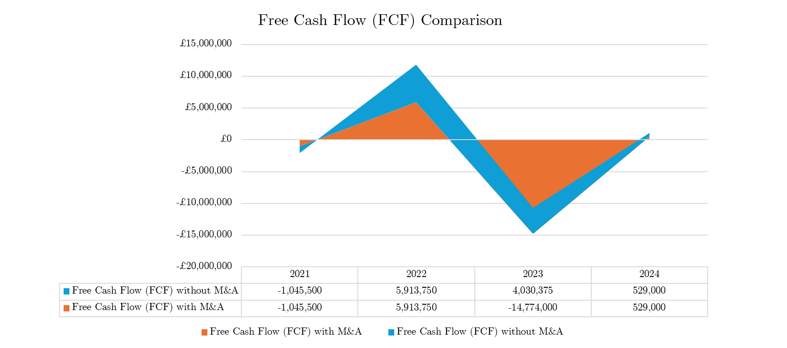
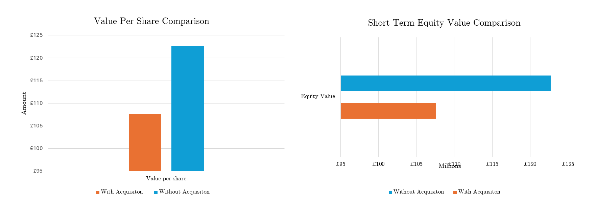

# Barclays Bank UK Acquisition of Kensington Mortgages (2023) – Valuation and DCF Impact Analysis

## 1. Introduction

This project analyses the impact of Barclays Bank UK’s acquisition of Kensington Mortgages in 2023 on shareholder value and company valuation using discounted cash flow (DCF) analysis. The study compares short-term financial distortions caused by acquisition-related outflows with long-term strategic benefits of the deal.

- [M&A Analysis Slides](Kensington_Mortgages_Barclays_MA_Analysis.pdf)  
- [Medium Case Study](https://medium.com/@yusufahmed101/barclays-acquisition-of-kensington-mortgages-dcf-impact-analysis)  

Central Thesis:

> While the acquisition caused a significant one-off reduction in free cash flow and enterprise value in 2023, the long-term strategic benefits of market access, operational synergies, and funding capacity outweigh the short-term distortion and position Kensington for sustainable growth.

All valuation modelling was carried out using Excel, DCF frameworks, and company filings, supported by qualitative analysis of strategic drivers.

## Table of Contents

- [Introduction](#1-introduction)  
- [Valuation Comparison](#2-valuation-comparison)  
- [Short-Term Financial Impact](#3-short-term-financial-impact)  
- [Comparison of Share Values](#4-comparison-of-share-values)  
- [Long-Term Perspective](#5-long-term-perspective)  
- [M&A Evaluation](#6-m-a-evaluation)  
- [Conclusion](#7-conclusion)  
- [References](#8-references)  

## 2. Valuation Comparison

| Scenario              | Value per Share (£) |
|-----------------------|----------------------|
| With acquisition      | 107.55              |
| Without acquisition   | 122.70              |

**Difference:** ~£15/share  

This quantifies the short-term distortion created by the acquisition-related outflows.

## 3. Short-Term Financial Impact

- Free Cash Flow (FCF): −£14,774,000
- PV drag: −£12,434,980
- Enterprise Value: £2,421,826
- Share price falls to £107.55

## 4. Comparison of Share Values

DCF Valuation: With vs Without Acquisition  

- With acquisition: £107.55/share  
- Without acquisition: £122.70/share  
- Difference: ~£15/share  

 

## 5. Long-Term Perspective

- Terminal Value remains identical: £8,983,338  
- PVs for 2025–2027 remain stable: 384k → 361k → 339k
- Strategic benefits of the acquisition include:  
  1. Customer base expansion  
  2. Operational synergies  
  3. Funding access & market credibility  
  4. Specialist mortgage expertise  
  5. Technological scalability  

## 6. M&A Evaluation

- Short-term: acquisition reduces enterprise value and share price.  
- Long-term: stable cash flows and strategic upside outweigh the distortion.  

> M&A events create one-off distortions in DCF but strategic benefits are realised beyond the model horizon.

## 7. Conclusion

- Short-term: shareholder value fell by ~£15/share.  
- Long-term: synergies and strategic positioning restore value.  
- DCF analysis: captures financial distortion but not full strategic benefit.  

## 8. References

- Kensington Mortgage Company Limited. (2024). *Full Accounts 2024*. [Companies House](https://find-and-update.company-information.service.gov.uk/company/03049877/filing-history)  
- Barclays PLC. (2023). *Annual Report 2023*. [Barclays IR](https://home.barclays/content/dam/home-barclays/documents/investor-relations/IRNewsPresentations/2022News/20220624-Acquisition-of-Kensington-Mortgage-Company.pdf)  
- Blackstone & Sixth Street. (2023). *Press Release – Sale of Kensington Mortgages*. [Blackstone](https://www.blackstone.com/news/press/blackstone-and-sixth-street-agree-sale-of-kensington-mortgages-to-barclays-bank-uk-plc)  
- Kensington Mortgages. (2023). *Blog – Sale of Kensington Mortgages to Barclays Bank UK Plc closes*. [Kensington Blog](https://www.kensingtonmortgages.co.uk/blog/article/sale-of-kensingtonmortgages-to-barclays-bank-uk-plc-closes)  